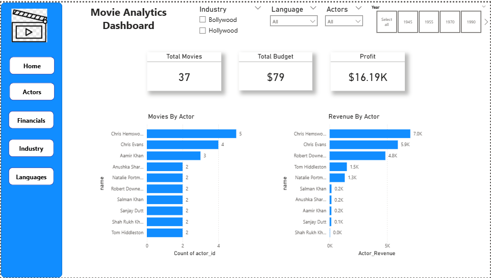
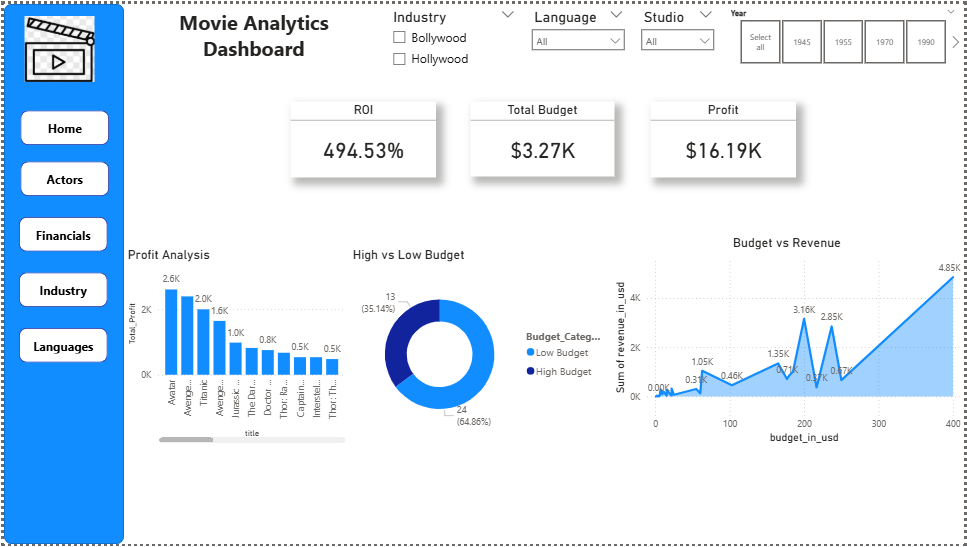
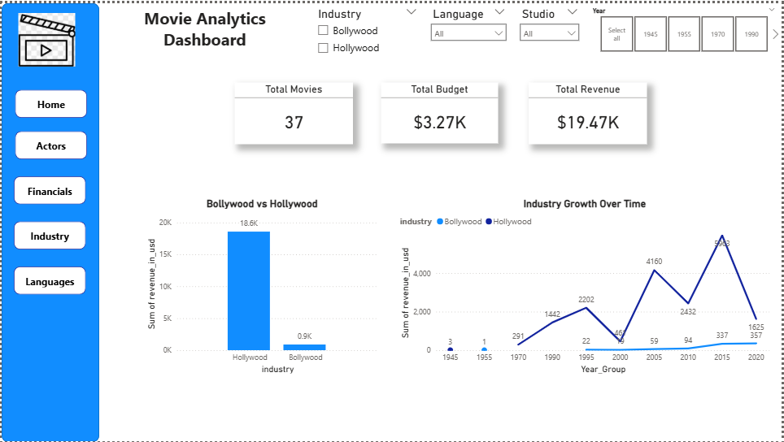
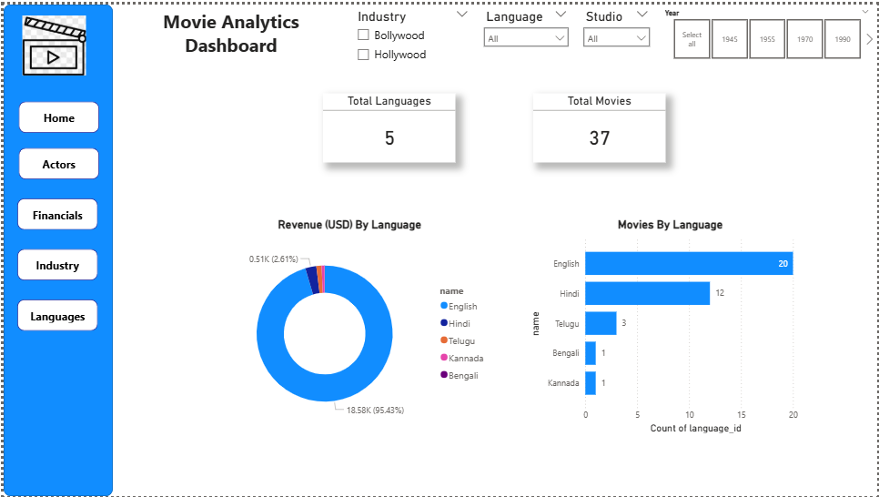

# 🎬 Movie Analytics Dashboard

An interactive multi-page dashboard built using Power BI and MySQL to analyze movie performance, financial metrics, and actor insights.

## 🚀 Features

* Multi-page dashboard with navigation
* Interactive slicers (Industry, Year, Language, Actor)
* KPI Cards (Revenue, Profit, ROI)
* Actor-level and financial analysis
* Clean and user-friendly design

## 🛠️ Tools & Technologies

* Power BI
* MySQL
* DAX

## 📊 Key Metrics

- Total Revenue
- Total Profit
- ROI (Return on Investment)
- Total Movies
- Total Actors

## 📊 Key Insights

* Identified top-performing movies and actors
* Analyzed ROI to evaluate investment efficiency
* Compared industries and languages for performance trends

## 📸 Dashboard Preview

## 🎥 Live Demo

👉 [▶️ Watch Dashboard Demo on LinkedIn](https://www.linkedin.com/posts/rana-ali-husnain_powerbi-dataanalytics-businessintelligence-ugcPost-7447216788913885184-KllN)

---

## 📌 Note

This project demonstrates data modeling, DAX measures, and interactive dashboard design for real-world analytics scenarios.
